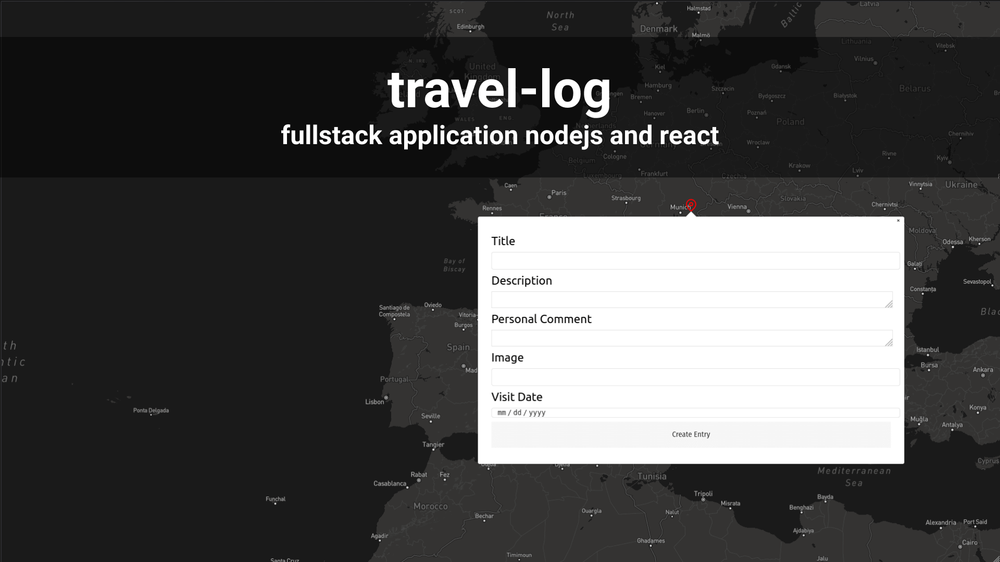

# Simple Travel Log Fullstack Application

Basic Node Concepts with an example Application. 
REST API(JSON), React Frontend, MongoDB

## Server

### Dependencies Server
* express for server
* cors - express middleware cross orignin ressources
* morgan - express middleware for logging 
* helmet - https headers, resticting headers
* mongoose - models for mongodb
* dotenv - envoirement variables from file

### Dev Dependencies Server
* eslint
* nodemon
* eslint --> npx eslint --init

### Database Entrys

#### Log Entry <-- Places where you have been.
* Title - Text
* Description - Text
* Personal Comment - Text
* Rating 1 - 10
* Image - URL
* Start Date - DateTime
* End Date - DateTime
* Latitude - Number
* Longitude - Number
* Created AT - DateTime
* Updated - DateTime

## Client
* react-map-gl
* react-hook-form